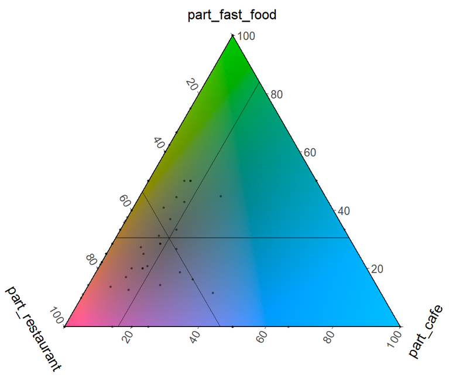

```{r setup-practical, child = '_setup.Rmd'}
```

```{r knitr_init, echo=FALSE, cache=FALSE, include=FALSE}
#remotes::install_github("koncina/unilur@dev")
library(stringr)
library(knitr)
## Global options
options(max.print="90")
opts_chunk$set(echo=TRUE,
	             cache=FALSE, #TRUE
               prompt=FALSE,
               tidy=FALSE,
               comment=NA,
               message=FALSE,
               warning=FALSE)
opts_knit$set(width=90)
options(width = 90)

# no margins
knit_hooks$set(nm = function(before, options, envir){
  if (before){
    par(mar=c(0,0,0,0))
  }
})

# title margins
knit_hooks$set(sm = function(before, options, envir){
  if (before){
    par(mar=c(0,0,1.2,0))
  }
})


```

# Exercice 1 : Manipuler les objets sf et des data.frames associés

1. Charger la couche cartographique des iris du département 31 "iris_31.rds" dans R. Est-ce que la fonction `sf::st_read` fonctionnerait également ? Pourquoi ?

<details>
<summary style="color:orange;font-family:courier;font-size:150%"><b>CLUES</b></summary>
Utilisez la fonction `readRDS`.
</details>

```{r, solution = TRUE}
library(sf)
iris_31 <- readRDS("../data/iris_31.rds")
# iris_31 <- st_read("../data/iris_31.rds")
```

```{block, solution = TRUE}
Cela ne fonctionne pas car il ne s'agit pas d'un shapefile mais d'un fichier déjà mis au format R. Il suffit alors simplement de le charger avec la fonction readRDS.
```

2. Afficher simplement le fond de carte du département 31 avec l'instruction `plot(iris_31)`.
Que remarquez-vous ? 


```{r, nm=TRUE, solution = TRUE}
plot(iris_31)
# On remarque que R effectue un graphique par variable présent dans le fichier sf, ici 3.


```


3. Quel est le rôle de la fonction `sf::st_geometry` ? Quelle solution proposez-vous alors ? 

```{r, nm=TRUE, solution = TRUE}
# ?sf::st_geometry
# Cette fonction permet d'isoler les informations de l'objet sf relatives à sa géométrie et d'ainsi mettre de côté les autres variables ici CODE_IRIS, P14_POP et INSEE_COM
plot(st_geometry(iris_31))
```

4. En quelle projection est la couche cartographique ? Cartographiez-la dans une autre projection. 

<details>
<summary style="color:orange;font-family:courier;font-size:150%"><b>CLUES</b></summary>
Utilisez la fonction `sf::st_crs` pour deviner la projection et `sf::st_transform` pour changer la projection. Vous pouvez par exemple tester l'Azimuthal Equidistant projection telle que "crs="+proj=aeqd +lat_0=90 +lon_0=0" pour voir une nette différence. 
</details>


```{r, nm=TRUE, eval=FALSE, solution = TRUE}
#?st_crs
st_crs(iris_31)
par(mar = c(0,0,0,0), mfrow = c(1,2))
plot(st_geometry(iris_31))
plot(st_transform(st_geometry(iris_31), crs="+proj=aeqd +lat_0=90 +lon_0=0"))
```

```{r, nm=TRUE, echo=FALSE}
par(mar = c(0,0,0,0), mfrow = c(1,2))
plot(st_geometry(iris_31))
plot(st_transform(st_geometry(iris_31), crs="+proj=aeqd +lat_0=90 +lon_0=0"))
```

5. A partir de la couche "iris_31", créez une couche cartographique appelée "com_31" qui correspond aux communes du département 31. Gardez également dans cette nouvelle couche les informations sur la population présente dans chaque commune. 

```{block, box.title=" Information",box.type = "advice"}
La couche cartographique "iris_31"" contient les codes communes dans sa variable INSEE_COM et la population municipale de 2014 dans sa variable P14_POP.
```

<details>
<summary style="color:orange;font-family:courier;font-size:150%"><b>CLUES</b></summary>
Utilisez les fonctions classiques du package dplyr `select`, `group_by` et `summarize` qui s'appliquent aussi sur des objets de type sf.
</details>


```{r, nm=TRUE, eval=FALSE, solution = TRUE}
library(dplyr)
com_31 <- iris_31 %>%
  select(INSEE_COM,P14_POP) %>%
  group_by(INSEE_COM) %>% 
  summarize(P14_POP= sum(P14_POP)) %>% 
  st_cast("MULTIPOLYGON")

plot(st_geometry(com_31))
```

```{r, nm=TRUE, echo=FALSE}
com_31 <- iris_31 %>%
  select(INSEE_COM,P14_POP) %>%
  group_by(INSEE_COM) %>% 
  summarize(P14_POP= sum(P14_POP)) %>% 
  st_cast("MULTIPOLYGON")

plot(st_geometry(com_31))
```

6. En utilisant les données contenues dans "sir_31", ajoutez à cette couche le nombre de restaurants par commune. 

```{block, box.title=" Information",box.type = "advice"}
Le code commune n'est pas présent dans la base "sir_31". Pour l'obtenir, il faut créer une variable INSEE_COM (5 chiffres) qui contatène les variables DEPET (2 chiffres) et COMET (3 chiffres).
```


```{r, nm=TRUE, solution = TRUE}
sir_31 <- readRDS("../data/sir_31.rds")

com_31 <- left_join(com_31,
                    sir_31 %>%
  mutate(INSEE_COM=paste0(DEPET,COMET)) %>% 
  group_by(INSEE_COM) %>% 
   summarize(nb_of_rest= n()) %>% 
  st_set_geometry(NULL),
                    by=c("INSEE_COM"="INSEE_COM")
) %>% 
  mutate(nb_of_rest=ifelse(is.na(nb_of_rest),0,nb_of_rest))
```

7. Agrégez toutes les informations présentes dans "com_31" au niveau des intercommunalités (EPCI). 

```{block, box.title=" Information",box.type = "advice"}
Il faut utiliser la table de passage "table_MAUP.rds" pour avoir une correspondance entre le code communal (CODGEO) et le code de l'intercommunalité (EPCI).
```


```{r, nm=TRUE, eval=FALSE, solution = TRUE}
table_passage <- readRDS("../data/table_MAUP.rds") %>% 
  select(CODGEO,EPCI)

epci_31  <- com_31 %>%
  left_join(table_passage,by=c("INSEE_COM"="CODGEO")) %>% 
  group_by(EPCI) %>% 
  summarize(P14_POP=sum(P14_POP),nb_of_rest= sum(nb_of_rest)) %>% 
  st_cast("MULTIPOLYGON")

plot(st_geometry(epci_31))
```


```{r, nm=TRUE, echo=FALSE}
table_passage <- readRDS("../data/table_MAUP.rds") %>% 
  select(CODGEO,EPCI)

epci_31  <- com_31 %>%
  left_join(table_passage,by=c("INSEE_COM"="CODGEO")) %>% 
  group_by(EPCI) %>% 
  summarize(P14_POP=sum(P14_POP),nb_of_rest= sum(nb_of_rest)) %>% 
  st_cast("MULTIPOLYGON")

plot(st_geometry(epci_31))
```


```{block, box.title="Information",box.type = "advice"}
On peut remarquer que le nombre de restaurants est très faible voire nul dans la plupart des communes. On va donc vouloir créer une couche cartographique qui utilise partiellement le zonage communal et partiellement le zonage en EPCI. 
```

8. On souhaite cartographier le nombre de restaurants au niveau communal si son EPCI contient plus de 100 restaurants et au niveau intercommunal si l'EPCI contient moins de 100 restaurants.Créez une couche cartographique qui réponde à ce besoin. 

<details>
<summary style="color:orange;font-family:courier;font-size:150%"><b>CLUES</b></summary>
Commencez par créer les couches EPCI_less100 et COM_more100 qui correspondent respectivement aux EPCI qui contiennent moins de 100 restaurants et aux communes qui appartiennent à un EPCI contenant plus de 100 restaurants. Puis, utilisez l'instruction `do.call(rbind, list(EPCI_less100,COM_more100))` pour les fusionner.
</details>


```{r, nm=TRUE, eval=FALSE, solution = TRUE}
EPCI_less100 <- epci_31 %>% filter(nb_of_rest < 100) %>% 
  setNames(c("territory","P14_POP","nb_of_rest","geometry"))

COM_more100 <- left_join(com_31,table_passage,by=c("INSEE_COM"="CODGEO")) %>% 
  filter(!EPCI%in%EPCI_less100$territory) %>% 
  select(-EPCI) %>% 
  setNames(c("territory","P14_POP","nb_of_rest","geometry"))

par(mar = c(0,0,0,0), mfrow = c(1,2))
plot(st_geometry(epci_31))
plot(st_geometry(EPCI_less100), col="lightblue",add=TRUE)
plot(st_geometry(epci_31))
plot(st_geometry(COM_more100), col="lightblue",add=TRUE)

mix_31 <- do.call(rbind, list(EPCI_less100,COM_more100))

plot(st_geometry(mix_31), col="lightblue")
```

####{.tabset}

##### Municipalities
```{r, nm=TRUE, echo=FALSE}
EPCI_less100 <- epci_31 %>% filter(nb_of_rest < 100) %>% 
  setNames(c("territory","P14_POP","nb_of_rest","geometry"))

COM_more100 <- left_join(com_31,table_passage,by=c("INSEE_COM"="CODGEO")) %>% 
  filter(!EPCI%in%EPCI_less100$territory) %>% 
  select(-EPCI) %>% 
  setNames(c("territory","P14_POP","nb_of_rest","geometry"))

plot(st_geometry(epci_31))
plot(st_geometry(EPCI_less100), col="lightblue",add=TRUE)
```

##### Intercommunalities
```{r, nm=TRUE, echo=FALSE}
plot(st_geometry(epci_31))
plot(st_geometry(COM_more100), col="lightblue",add=TRUE)
```

##### Both
```{r, nm=TRUE, echo=FALSE}
mix_31 <- do.call(rbind, list(EPCI_less100,COM_more100))
plot(st_geometry(mix_31), col="lightblue")
```

####{}

9. A l'aide du package {cartography}, ajoutez simplement à cette carte un rond proportionnel au nombre de restaurants sur chacun de ces territoires.

<details>
<summary style="color:orange;font-family:courier;font-size:150%"><b>CLUES</b></summary>
C'est la fonction `propSymbolsLayer` qui permet de dessiner des ronds proportionnels. 
</details>


```{r, nm=TRUE, eval=FALSE, solution = TRUE}
library(cartography)
plot(st_geometry(mix_31), col = "ivory1", border = "ivory3",lwd =0.5,bg = "#FBEDDA")
propSymbolsLayer(mix_31, var = "nb_of_rest", inches = 0.2)
```

```{r, nm=TRUE, echo=FALSE}
library(cartography)
plot(st_geometry(mix_31), col = "ivory1", border = "ivory3",lwd =0.5,bg = "#FBEDDA")
propSymbolsLayer(mix_31, var = "nb_of_rest", inches = 0.2)
```


# Exercice 2 : Cartographie statique et interactive

```{block,box.title="Remarque pour Timothée",box.colour="#FF0099"}
Réaliser une carte avec tous les packages présentés par Timothée dans la partie "Maps with R".
En plus de cartography, leaflet et mapview, j'ai fait un exemple rapide avec ggplot2 ici car c'est un outil qui me semble important. A discuter de si on ajoute un petit exemple également dans ton document ?
=> En attente de la partie de Timothée sur leaflet et mapview pour continuer. 
```

1. Préparation des données : 

* Chargez dans R le fond cartographique des contours du territoire métropolitain français "fra.shp"
* En utilisant la couche "mix_31" de l'exercice précédent, créez une variable "nb_rest_10000inhab" qui correspond au nombre de restaurants pour 10 000 habitants sur le territoires
* Créez le vecteur "bks" qui correspond aux breaks des quantiles (n=6) sur la variable "nb_rest_10000inhab" en enlevant les doublons de ce vecteur
* Créez le vecteur "cols" qui correspond à un dégradé de orange (n=4)
* Enfin, ajoutez à la couche "mix_31" la variable "typo" qui indique directement la classe de discrétisation à partir des éléments contenus dans "bks" à appliquer à la variable "nb_rest_10000inhab" 

```{block, box.title="Information",box.type = "advice"}
Pour la création de bks et cols, on utilisera les fonctions `getBreaks` et `carto.pal` du package {cartography}.
Pour la création de la variable typo, vous pouvez utiliser la fonction `cut` en appliquant les paramètres digit.lab=2 et include.lowest = TRUE. 
```

```{r, solution=TRUE}
fra <- st_read("../data/fra.shp", quiet = TRUE)

mix_31 <- mix_31 %>% mutate(nb_rest_10000inhab = 10000 * nb_of_rest / P14_POP) 

bks <- getBreaks(v = mix_31$nb_rest_10000inhab, method = "quantile", nclass = 6)[-c(1:2)]

cols <- carto.pal("orange.pal", 4)

mix_31 <- mix_31 %>% mutate(typo = cut(nb_rest_10000inhab,breaks = bks, dig.lab = 2, include.lowest = TRUE))
```

2. A l'aide du package cartography, réalisez cette carte qui contient en applat de couleur la variable "nb_rest_10000inhab" et en rond proportionnel la variable "nb_of_rest". Réalisez la même chose avec le package ggplot2.

####{.tabset}

##### cartography
```{r, nm=TRUE, echo=FALSE}
par(mar = c(0.2, 0.2, 1.4, 0.2), bg = "azure")
plot(st_geometry(mix_31), border="azure")
plot(st_geometry(fra), col="ivory", border = "ivory3", xlim = bb[c(1, 3)], 
     ylim = bb[c(2, 4)],add=TRUE)

choroLayer(mix_31, var = "nb_rest_10000inhab", breaks = bks, col = cols, border = "grey80", lwd = 0.4, 
           legend.pos = "topleft", legend.title.txt = "Number of restaurants\nfor 10000 inhabitants", 
           add = TRUE)
propSymbolsLayer(mix_31, var="nb_of_rest", col=viridis::viridis(1,alpha=0.8),border=NA, legend.pos="left", legend.title.txt = "Number of restaurants", add = TRUE)
layoutLayer(title = "Restaurants", sources = "Insee, 2018", author = "Kim & Tim, 2018", 
            theme = "green.pal", col = "darkred", coltitle = "white", postitle = "center",
            frame = TRUE, scale = 10)
north(pos = "topright", south = TRUE)
```

##### ggplot2
```{r, nm=TRUE, echo=FALSE}
library(ggplot2)

map_ggplot <- ggplot() +
  geom_sf(data = fra, colour = "ivory3",
          fill = "ivory") +
  geom_sf(data = mix_31, aes(fill = typo), colour = "grey80") +
  scale_fill_manual(name = "Number of restaurants\nfor 10000 inhabitants",
                    values = cols, na.value = "#303030")+
   geom_sf(data = mix_31 %>%  st_centroid(),
           aes(size= nb_of_rest), color = viridis::viridis(1,alpha=0.8), show.legend = 'point')+
  scale_size(name = "Number of restaurants",
             breaks = c(1, 500, 2000),
             range = c(0,18))+
  coord_sf(crs = 2154, datum = NA,
           xlim = st_bbox(mix_31)[c(1,3)],
           ylim = st_bbox(mix_31)[c(2,4)]
  ) +
  theme_minimal() +
  theme(panel.background = element_rect(fill = "azure",color=NA)) +
  labs(
      title = "Restaurants",
      caption = "Insee, 2018\nKim & Tim, 2018"
  )

plot(map_ggplot)
```

####{}

Avec cartography :

```{r, eval=FALSE, solution=TRUE}
par(mar = c(0.2, 0.2, 1.4, 0.2), bg = "azure")
plot(st_geometry(mix_31), border="azure")
plot(st_geometry(fra), col="ivory", border = "ivory3", xlim = bb[c(1, 3)], 
     ylim = bb[c(2, 4)],add=TRUE)

choroLayer(mix_31, var = "nb_rest_10000inhab", breaks = bks, col = cols, border = "grey80", lwd = 0.4, 
           legend.pos = "topleft", legend.title.txt = "Number of restaurants\nfor 10000 inhabitants", 
           add = TRUE)
propSymbolsLayer(mix_31, var="nb_of_rest", col=viridis::viridis(1,alpha=0.8),border=NA, legend.pos="left", legend.title.txt = "Number of restaurants", add = TRUE)
layoutLayer(title = "Restaurants", sources = "Insee, 2018", author = "Kim & Tim, 2018", 
            theme = "green.pal", col = "darkred", coltitle = "white", postitle = "center",
            frame = TRUE, scale = 10)
north(pos = "topright", south = TRUE)
```

Avec ggplot2 :

```{r, eval=FALSE, solution=TRUE}
library(ggplot2)

map_ggplot <- ggplot() +
  geom_sf(data = fra, colour = "ivory3",
          fill = "ivory") +
  geom_sf(data = mix_31, aes(fill = typo), colour = "grey80") +
  scale_fill_manual(name = "Number of restaurants\nfor 10000 inhabitants",
                    values = cols, na.value = "#303030")+
   geom_sf(data = mix_31 %>%  st_centroid(),
           aes(size= nb_of_rest), color = viridis::viridis(1,alpha=0.8), show.legend = 'point')+
  scale_size(name = "Number of restaurants",
             breaks = c(1, 500, 2000),
             range = c(0,18))+
  coord_sf(crs = 2154, datum = NA,
           xlim = st_bbox(mix_31)[c(1,3)],
           ylim = st_bbox(mix_31)[c(2,4)]
  ) +
  theme_minimal() +
  theme(panel.background = element_rect(fill = "azure",color=NA)) +
  labs(
      title = "Restaurants",
      caption = "Insee, 2018\nKim & Tim, 2018"
  )

plot(map_ggplot)
```

3. Leaflet


```{block, box.type = "warning"}
Les html widgets semblent bugger avec unilur... Issue postée... html modifié à la main pour le moment...
```


```{r, eval=FALSE, solution=TRUE}
# Ajout des coordonnées X et Y dans mix_31
mix_31 <- bind_cols(mix_31,
          mix_31 %>%  st_centroid() %>% 
            st_transform('+proj=longlat +ellps=GRS80 +no_defs') %>%
            st_coordinates() %>% as.data.frame()) 

library(leaflet)
  carto <- leaflet(mix_31) %>%
    addTiles('http://{s}.tile.openstreetmap.org/{z}/{x}/{y}.png') %>%
    addCircles(lng = ~X, lat = ~Y, weight = 1,
               radius = ~sqrt(nb_of_rest)*300,
               popup = ~paste(nb_of_rest),
               color = ~colorQuantile(cols, domain=mix_31$nb_rest_10000inhab, probs= c(0,0.45,0.6,0.8,1.0))(nb_rest_10000inhab)) %>% 
    addLegend("topleft", 
              colors = cols,
              labels = paste0("[", round(bks,0)[-5], ";", round(bks,0)[-1],"["),
              title = "Number of restaurants<br>for 10 000 inhabitants",
              opacity = 1) 
  
  carto
  
```

```{r, echo=FALSE}
# Ajout des coordonnées X et Y dans mix_31
mix_31 <- bind_cols(mix_31,
          mix_31 %>%  st_centroid() %>% 
            st_transform('+proj=longlat +ellps=GRS80 +no_defs') %>%
            st_coordinates() %>% as.data.frame()) 

library(leaflet)
  carto <- leaflet(mix_31) %>%
    addTiles('http://{s}.tile.openstreetmap.org/{z}/{x}/{y}.png') %>%
    addCircles(lng = ~X, lat = ~Y, weight = 1,
               radius = ~sqrt(nb_of_rest)*300,
               popup = ~paste(nb_of_rest),
               color = ~colorQuantile(cols, domain=mix_31$nb_rest_10000inhab, probs= c(0,0.45,0.6,0.8,1.0))(nb_rest_10000inhab)) %>% 
    addLegend("topleft", 
              colors = cols,
              labels = paste0("[", round(bks,0)[-5], ";", round(bks,0)[-1],"["),
              title = "Number of restaurants<br>for 10 000 inhabitants",
              opacity = 1) 
  
  carto
```

# Exercice 3 : Cartogramme

Réaliser un cartogramme du département 31 au niveau intercommunal proportionnellement aux nombres de restaurants (données SIRENE). 

```{r, nm=TRUE, eval=FALSE, solution = TRUE}
library(cartogram)
cartogramme <- cartogram_cont(epci_31, "nb_of_rest", itermax = 5, maxSizeError = 1)
plot(st_geometry(cartogramme), col="lightblue")
```

####{.tabset}

##### Normal boundaries
```{r, nm=TRUE, echo=FALSE}
plot(st_geometry(epci_31), col="lightblue")
```

##### Cartogram
```{r, nm=TRUE, echo=FALSE}
library(cartogram)
cartogramme <- cartogram_cont(epci_31, "nb_of_rest", itermax = 5, maxSizeError = 1)
plot(st_geometry(cartogramme), col="lightblue")
```

####{}


# Exercice 4 : Linemap

Réaliser une linemap des communes du département 31 proportionnellement au nombre de restaurants présents dans chaque commune (données SIRENE). 

```{block, box.title=" Information",box.type = "advice"}
Utilisez la couche cartographique "com_31" des exercices précédents et le package {linemap}. 
```

<details>
<summary style="color:orange;font-family:courier;font-size:150%"><b>CLUES</b></summary>
Pensez à utiliser les deux fonctions `getgrid` et `linemap` de ce package. 
Les paramètres suivants fonctionnent : cellsize = 1750, k = 400 et threshold = 0.01
</details>


```{r, nm=TRUE, eval=FALSE, solution = TRUE}
library(linemap)
grid <- getgrid(x = com_31, cellsize = 1750, var = "nb_of_rest")
plot(sf::st_geometry(com_31), col="ivory1", border = NA)
opar <- par(mar=c(0,0,0,0), bg = "ivory2")
linemap(x = grid, var = "nb_of_rest", k = 400, threshold = 0.01,
        col = "ivory1", border = "ivory4", lwd = 0.6, add = TRUE)
```

```{r, nm=TRUE, echo=FALSE}
library(linemap)
grid <- getgrid(x = st_transform(com_31, crs=st_crs(occitanie)), cellsize = 1750, var = "nb_of_rest")
plot(sf::st_geometry(st_transform(com_31, crs=st_crs(occitanie))), col="ivory1", border = NA)
opar <- par(mar=c(0,0,0,0), bg = "ivory2")
linemap(x = grid, var = "nb_of_rest", k = 400, threshold = 0.00001,
        col = "ivory1", border = "ivory4", lwd = 0.6, add = TRUE)
```


# Exercice 5 : Carte tricolore

#####  {.bonus}

Réaliser une carte tricolore qui représente les iris de Toulouse en fonction de si elles sont plutôt dotées en restaurants, cafés ou fast foods (données OSM)

##### {}


```{block, box.type = "warning"}
Pour le moment, la fonction Tricolore est buggée suite à la mise à jour de ggplot2...
Une issue a été postée, à voir si ce problème sera fixé avant Florence. 
A titre d'exemple, j'ai compilé le code de la fonction avec une ancienne version de ggplot2 et j'ai enregistré le résultat de la fonction Tricolore dans tric.rds
```


```{r, nm=TRUE, solution = TRUE}
bdd <- readRDS("../data/osm_31.rds") %>% 
  filter(INSEE_COM=="31555")

bdd_restaurant <- bdd %>% filter(amenity=="restaurant") %>%  
  group_by(CODE_IRIS) %>% 
   summarize(restaurant= n()) %>% 
  st_set_geometry(NULL)

bdd_fast_food <- bdd %>% filter(amenity=="fast_food") %>%  
  group_by(CODE_IRIS) %>% 
   summarize(fast_food= n()) %>% 
  st_set_geometry(NULL)

bdd_cafe <- bdd %>% filter(amenity=="cafe") %>%  
  group_by(CODE_IRIS) %>% 
   summarize(cafe= n()) %>% 
  st_set_geometry(NULL)

couche_carto <- left_join(iris_31 %>%  filter(INSEE_COM=="31555"), 
                          bdd_restaurant,
                          by=c("CODE_IRIS"="CODE_IRIS")
) %>% 
left_join(bdd_fast_food,by=c("CODE_IRIS"="CODE_IRIS")) %>% 
left_join(bdd_cafe,by=c("CODE_IRIS"="CODE_IRIS")) %>% 
  replace(is.na(.),0) %>% 
  mutate(part_restaurant = restaurant / (restaurant + fast_food + cafe), 
         part_fast_food = fast_food / (restaurant + fast_food + cafe), 
         part_cafe = cafe / (restaurant + fast_food + cafe)
         )

#devtools::install_github("jschoeley/tricolore")
library(tricolore)

# tric <- Tricolore(couche_carto %>% st_set_geometry(NULL), 'part_restaurant', 'part_fast_food', 'part_cafe', center = NA)
#saveRDS(object = tric, file = "../data/tric.rds")
tric <- readRDS("../data/tric.rds") 
#tric$legend


couche_carto <- bind_cols(couche_carto,tric$hexsrgb %>% as_data_frame() %>% replace(is.na(.),"#FFFFFFFF"))

library(ggplot2)
q <- ggplot(couche_carto) +
    geom_sf(aes(fill = value)) +
  scale_fill_identity() 

q
```

<center></center>


--------------------------------------------

--------------------------------------------

**reproducibility**

```{r}
sessionInfo()
```
